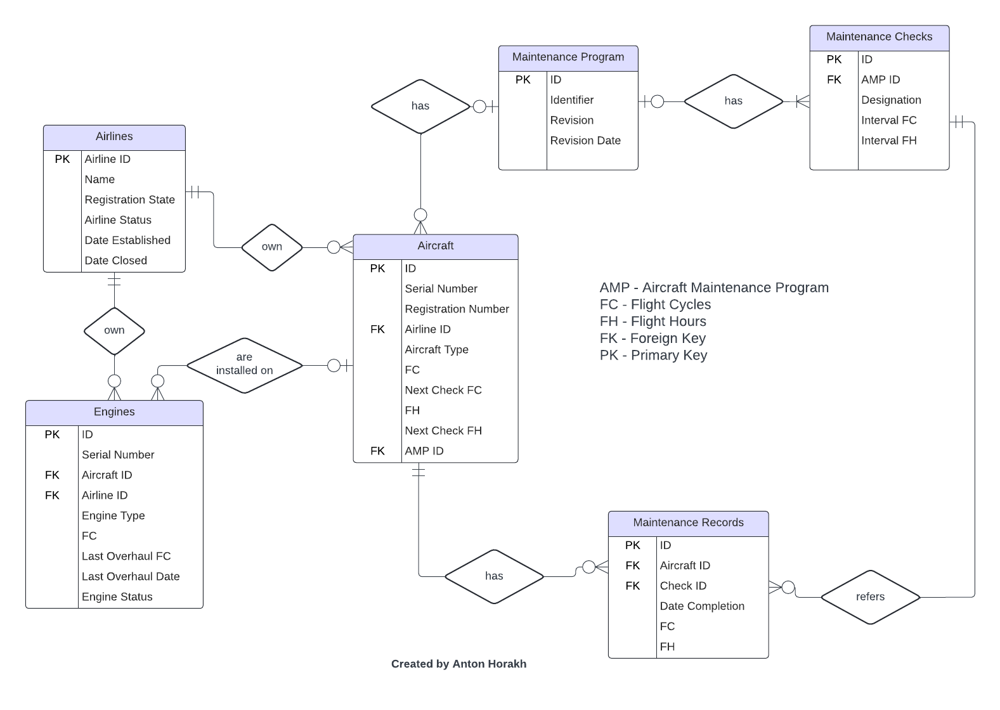

# Design Document

By **Anton Horakh**

Video overview: https://youtu.be/7tavkJqi4o4

## Scope

#### NOTE: The database was designed in PostgreSQL.

The designed database represents a simplified model intended for use by a Continuing Airworthiness Management Organization (CAMO). It allows for maintaining records related to an airline's current fleet, including:
* information about airline companies
* aircraft
* engines
* aircraft maintenance programs
* maintenance check (packages of maintenance tasks)
* technical records of performed maintenance services

## Functional Requirements

This database will support:
* Record and track information about each aircraft in the fleet.
* Store and manage details of Aircraft Maintenance Programs (AMPs).
* Log completed maintenance checks and technical records
* Keep records of engines installed on the aircraft

## Representation

Entities are captured in **_PostgreSQL_** tables with the following schema.

### Entities

The database includes the following entities:

### Airline

The `airlines` table includes:

* `id` specifies the unique ID for the airline, defined as a `SERIAL` auto-incrementing primary key.
* `name` - the name of the airline, stored as a `VARCHAR(64)`. This field must be unique.
* `registration_state` - country code where the airline is registered, represented as a custom type `ENUM` `country_code`.
* `arl_status`, which is the current operational status of the airline, stored as a `VARCHAR(6)`, with values restricted to '_active_' or '_closed_'.
* `date_established`, which is the date when the airline was established, stored as a `DATE`. Cannot be later than today's date.
* `date_closed`, which is the date when the airline ended operations, stored as `DATE`. `NULL` is default for active airlines.
* Constraint `check_arl_status` ensures that an active airline cannot have a `date_closed` other than `NULL` and in case of closed status that the `date_closed` is no later than today's date.

### Aircraft

The `aircraft` table includes:

* `id` specifies the unique ID for the aircraft, defined as a `SERIAL` auto-incrementing primary key.
* `ac_serial_number`, which is manufacturer `UNIQUE` aircraft serial number, which can contain letters and numbers, that is why represented as `VARCHAR(16)`. Cannot be `NULL`.
* `reg_num`, which is a `UNIQUE` number under which aircraft is registered in the country. Contains letters and numbers, so `VARCHAR(16)` is used for it.
* `airline_id`, which is the ID of the airline which possess this aircraft. It is `FOREIGN KEY`, referencing the `id` column in the `airlines` table. Cannot be `NULL`.
* `ac_type`, which is a manufacturer type (model) of the aircraft, defined by international standards, that is why it is represented as a custom type `ENUM` `aircraft_type`.
* `ac_flight_cycles`, which is the number of flights the aircraft took, stored as `INTEGER`. Cannot `NULL`.
* `next_check_fc`, which is the number of flights when the next maintenance should be performed, stored as `INTEGER`.
* `ac_flight_hours`, which is the number of hours the aircraft was in the air. Is stored as `NUMERIC(10, 1)`, cannot be `NULL`.
* `next_check_fh`, which is the same as `next_check_fc`, but flight hours instead of cycles. Stored as `NUMERIC(10, 1)`.
* `amp_id`, which is the ID of the maintenance program which is applied for that aircraft. Stored as `INTEGER`. It is `FOREIGN KEY`, referencing the `id` column in the `maintenance_program` table.
* Constraint `check_next_check` ensures that either `next_check_fc` or `next_check_fh` is not `NULL`.
* Constraint `check_positive` ensures that `ac_flight_cycles`, `next_check_fc`, `ac_flight_hours` and `next_check_fh` have positive value.

### Engine

The `engines` table includes:

* `id` specifies the unique ID for the aircraft engine, defined as a `SERIAL` auto-incrementing primary key.
* `eng_serial_number`, which is manufacturer `UNIQUE` engine serial number, which can contain letters and numbers, that is why represented as `VARCHAR(16)`. Cannot be `NULL`.
* `airline_id`, which is the ID of the airline which possess this engine. It is `FOREIGN KEY`, referencing the `id` column in the `airlines` table. Cannot be `NULL`.
* `ac_id`, which is the ID of the aircraft on which the engine is installed. It is `FOREIGN KEY`, referencing the `id` column in the `aircraft` table.
* `eng_type`, which is a manufacturer type (model) of the aircraft, defined by international standards, that is why it is represented as a custom type `ENUM` `engine_type`.
* `eng_flight_cycles`, which is the number of flights the engine took, stored as `INTEGER`. Cannot be negative or `NULL`.
* `last_overhaul_fc`, number of cycles which the engine had at the time of last overhaul. Stored as `INTEGER`. Cannot be greater than `eng_flight_cycles`.
* `last_overhaul_date`, which is the date when an overhaul was completed. Stored as `DATE`.
* `eng_status`, which is the current status of the engine like 'installed', 'storage' and etc. Stored as custom type `ENUM` `eng_status`. Cannot be `NULL`.

### Maintenance Program

The `maintenance_program` table includes:

* `id` specifies the unique ID for the aircraft maintenance program, defined as a `SERIAL` auto-incrementing primary key.
* `identifier`, which is `UNIQUE` alphanumerical code of the maintenance program. Stored as `VARCHAR(128)`. Cannot be `NULL`.
* `revision`, which is the current actual revision of the document, usually short number. Stored as `VARCHAR(4)`. Cannot be `NULL`.
* `revision_date`, which is the date of the last revision. Stored as `DATE`, cannot be `NULL`. The inserted date cannot be later than today's date.

### Maintenance Check

The `maintenance_check` table includes:

* `id` specifies the unique ID for the maintenance check, defined as a `SERIAL` auto-incrementing primary key.
* `amp_id`, which is the ID of the maintenance program of which this check is a part. Stored as `INTEGER`. It is `FOREIGN KEY`, referencing the `id` column in the `maintenance_program` table. Cannot be `NULL`
* `designation`, which is a short designation of the task packege called 'check' usually in an alphanumeric form like 'A1', stored as `VARCHAR(16)`. Cannot be `NULL`.
* `interval_fc`, which is an interval in flight cycles at which maintenance should be performed. Stored as `INTEGER`.
* `interval_fh`, which is an interval in flight hours at which maintenance should be performed. Stored as `INTEGER`.
* Constraint `unique_check_per_amp` ensures that one check can be associated only with one AMP.
* Constraint `unique_interval` ensures that amp cannot be associated with different check having exactly the same intervals.
* Constraint `interval_check` ensures that both `interval_fc` and `interval_fh` cannot be `NULL` at the same time.

### Maintenance Records

The `maintenance_records` table includes:

* `id` specifies the unique ID for the maintenance record, defined as a `SERIAL` auto-incrementing primary key.
* `ac_id`, which is the ID of the aircraft to which this record refers. It is `FOREIGN KEY`, referencing the `id` column in the `aircraft` table. Cannot be `NULL`.
* `check_id`, which is the ID of the performed check. It is `FOREIGN KEY`, referencing the `id` column in the `maintenance_check` table. Cannot be `NULL`.
* `date_completion`, which is the date when maintenance was completed. Stored as `DATE`. Cannot be `NULL`. The inserted date cannot be later than today's date.
* `fc_record`, number of cycles which the aircraft had at the time maintenance was completed. Stored as `INTEGER`.
* `fh_record`, number of flight hours which the aircraft had at the time maintenance was completed. Stored as `NUMERIC(10, 1)`.
* Constraint `record_check` ensures that `fc_record` and `fh_record` are not negative.

### Relationships

The below entity relationship diagram describes the relationships among the entities in the database. I used "Crow’s Foot Notation" (also called IE notation).

As detailed by the diagram:
* One airline can have 0 to many aircraft and 0 to many engines.
* Aircraft and engine is owned by one and only one airline.
* Aircraft can have installed 0 to many engines, and each engine can be installed on 0 or 1 aircraft.
* Maintenance program can be applied to 0 (for example in case outdated program) to many aircraft. Each ircraft can be associated with 0 or 1 maintenance program.
* Maintenance program must have at least one associated maintenance check but can have many, and each maintenance check can be associated with no or one maintenance program.
* An aircraft can have 0 or many associated maintenance records. Each maintenance record refers to one and only one aircraft and one maintenance check. A maintenance check can be referenced by 0 or many maintenance records.

## Optimizations

Per the typical queries in `queries.sql`, it is common to search for an aircraft by its registration number. For this reason, an index is created on the `reg_num` column of the `aircraft` table.
Similarly, an index is created on the `eng_serial_number` column of the `engines` table to optimize searches for engines by their serial numbers.
Records are often queried by aircraft, so an index is created on the `ac_id` column of the `maintenance_records` table.

## Limitations

This Database has no restrictions on number of engines installed on each aircraft type.
The Database does not include elements such as aircraft components, specific maintenance tasks, release-to-service certificates, and similar details.